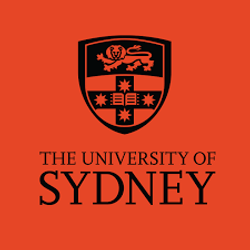
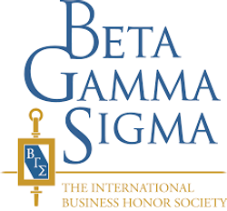

## About Me 🤗

Hi! I am an Honours student of Business Analytics @ University of Sydney!
My thesis topic is **Knowledge Graph-Augmented Large Language Model Adaptation for Domain-Specific Question Answering**.
I am dedicated to machine learning and deep learning fields. I also enjoy developing some Python-based cool gadgets that are ~~useless~~ useful to serve my needs.
Check out my [GitHub](https://github.com/CodeBoyPhilo) for more!

## Research Interests 💭

- **Large Language Models:** knowledge-empowered generation, LLM-based applications
- **Graph Neural Networks:** knowledge embeddings, graph learning

## Highlights 🎓

<h4 style="margin:0 10px 0;">Coursework</h4>

- **[[BUSS1020]](https://www.sydney.edu.au/units/BUSS1020)** **[Quantitative Business Analysis]**: 94/100
- **[[QBUS1040]](https://www.sydney.edu.au/units/QBUS1040)** **[Foundations of Business Analytics]**: 95/100
- **[[QBUS2310]](https://www.sydney.edu.au/units/QBUS2310)** **[Management Science]**: 99/100 (lucky)
- **[[QBUS2820]](https://www.sydney.edu.au/units/QBUS2820)** **[Predictive Analytics]**: 86/100
- **[[QBUS3820]](https://www.sydney.edu.au/units/QBUS3820)** **[Machine Learning and Data Mining in Business**: 86/100
- **[[QBUS3330]](https://www.sydney.edu.au/units/QBUS3330)** **[Methods of Decision Analysis]**: 86/100
- **[[QBUS3600]](https://www.sydney.edu.au/units/QBUS3600)** **[Business Analytics in Practice]**: 85/100 (Capstone unit)
  - 🏆 Our team was selected to present my modelling solution to the client **Big W**

<h4 style="margin:0 10px 0;">Honours Level Coursework</h4>

- **[[BUSS4931]](https://www.sydney.edu.au/units/BUSS4931)** **[Advanced Business Statistics]**: 94/100
- **[[BUSS4932]](https://www.sydney.edu.au/units/BUSS4932)** **[Advanced Optimisation for Business]**: 88/100

<h4 style="margin:0 10px 0;">Awards and Scholarship</h4>

- **[2024] University of Sydney Honours Scholarship**
- **[2022] Dean's List of Excellence in Academic Performance**
- **[2022] Academic Merit Prize**
- **[2022] Lifetime Member of Beta Gamma Sigma**
